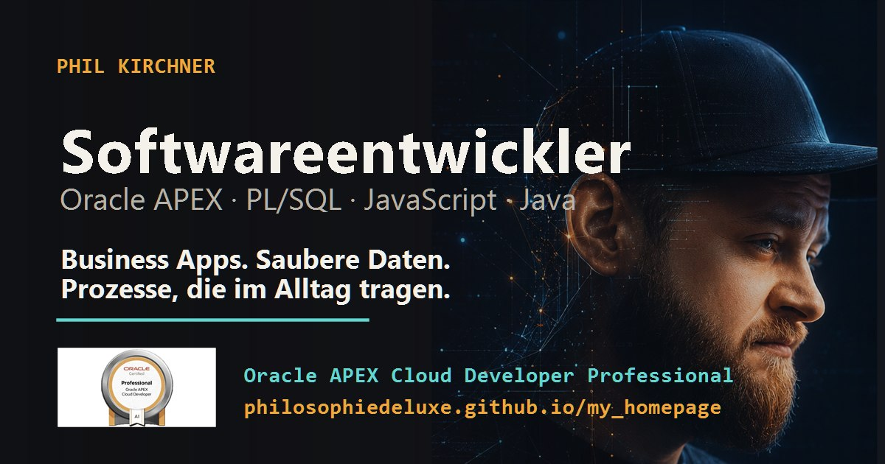

# Phil Kirchner Portfolio


A modern, trilingual portfolio website for a software developer with a strong focus on Oracle APEX, PL/SQL, JavaScript and business-oriented application development.

The project is intentionally built as a lightweight static site: no framework, no build step, no external runtime dependencies, no analytics and no tracking.

## Live Site

```text
https://philosophiedeluxe.github.io/my_homepage/
```

## Preview



## About the Project

This homepage presents the professional profile of Phil Kirchner as a software developer with practical experience in business processes, data-driven applications and Oracle-based development.

The site combines a clean dark visual style with a technical portfolio structure. It is designed for fast loading, clear navigation and direct presentation of relevant skills, projects, certificates and contact channels.

## Core Features

- Responsive portfolio homepage for desktop, tablet and mobile
- Interactive signal canvas with a Firefox-aware render budget
- Scroll progress, active section navigation and responsive pointer-reactive depth effects
- Global custom code cursor with dynamic text-cursor mode and keyword-aware labels
- Animated technology stream and visual project modules
- German, English and Japanese language switch
- Dedicated Vita / Resume page
- Browser-based PDF export for German, English and Japanese profile versions
- Print-optimized A4 layout for complete one-page PDF generation with language-aware document titles
- Project spotlight section with optimized tilt cards and restrained glow feedback
- Technology stack overview
- Certificate section with visual assets
- SEO basics with canonical URLs, OpenGraph metadata and Twitter Card metadata
- JSON-LD structured data for better search engine context
- Privacy-friendly setup without analytics or marketing cookies
- Local consent handling for cookie and language preferences
- Dedicated legal pages for Impressum and Datenschutz
- Custom 404 page
- Hidden Easter eggs for developer-oriented discovery interactions
- Lightweight QA script for local checks
- GitHub Pages compatible without build process

## Tech Stack

| Area | Technology |
| --- | --- |
| Markup | HTML5 |
| Styling | CSS3 |
| Logic | Vanilla JavaScript |
| Hosting | GitHub Pages |
| SEO | Meta tags, OpenGraph, Twitter Cards, JSON-LD, sitemap.xml, robots.txt |
| PDF Export | Browser print dialog with dedicated print CSS |
| QA | PowerShell check script |

## Project Structure

```text
.
├── index.html              # Main portfolio page
├── vita.html               # Vita / Resume page with PDF print support
├── impressum.html          # Legal notice
├── datenschutz.html        # Privacy policy
├── 404.html                # Custom not-found page
├── style.css               # Complete styling including responsive and print layouts
├── app.js                  # Language switch, navigation, consent logic, animations, PDF print logic
├── sitemap.xml             # Sitemap for search engines
├── robots.txt              # Search engine crawling hints
├── QA.md                   # Local QA instructions
├── ROADMAP.md              # Project roadmap and design notes
├── tools/
│   └── check-site.ps1      # Lightweight local validation script
└── image/
    ├── social-card.jpg     # OpenGraph / preview image
    ├── iconic.jpg          # Main visual asset
    ├── iconic-720.jpg      # Responsive image variant
    ├── iconic-960.jpg      # Responsive image variant
    └── Cert/               # Certificate images and badges
```

## Design Direction

The visual concept is dark, precise and technical. Purple is used as a controlled accent color, while animated signal lines, restrained grid structures and responsive depth effects create a distinctive developer identity.

Key design principles:

- clean dark interface
- reduced but recognizable technical aesthetic
- expressive motion with reduced-motion and browser-specific fallbacks
- strong typography and clear section hierarchy
- portfolio content first, decoration second
- mobile-first interaction behavior
- accessible navigation and readable contrast

## Interaction System

The site uses a global custom cursor and a set of controlled pointer effects. These effects are intentionally desktop-only and respect `prefers-reduced-motion`. Touch devices keep the native interaction model.

### Custom Cursor

The cursor is generated in `app.js` by `setupHeroCursor()` and styled in `style.css` with the `.hero-code-cursor` family of selectors. Despite the original function name, the cursor is now global and no longer limited to the hero section.

Cursor states:

| State | Trigger | Behavior |
| --- | --- | --- |
| Default | normal page surface | code-shaped pointer with cyan/magenta/core layers |
| Action | links, buttons and interactive controls | stronger split-layer action state |
| Text | readable text, text inputs and contenteditable areas | smaller I-beam cursor in the same visual style |
| Idle | pointer remains still for about 12 seconds | temporary sleeping cursor code |
| Keyword | selected technical words | temporary context label such as `SQL`, `APEX`, `DB`, `JS`, `AI`, `FLOW` or `{PK}` |

Technical keyword reactions are now range-based. The cursor checks the actual text rectangle under the pointer instead of loosely scanning the surrounding paragraph. This makes the signal more stable on dense text, buttons, links, card titles and multi-word terms. Supported terms include `Phil Kirchner`, `Phil`, `Kirchner`, `PK`, `Oracle APEX`, `Oracle DB`, `Oracle`, `APEX`, `PL/SQL`, `SQL`, `SQL Server`, `Microsoft SQL Server`, `JavaScript`, `JS`, `TypeScript`, `TS`, `Java`, `HTML`, `CSS`, `JSON`, `XML`, `XSD`, `KI`, `AI`, `Git`, `GitHub`, `REST`, `RESTful`, `RESTful Services`, `REST Data Sources`, `API`, `Endpoint`, `DBMS`, `Datenbank`, `Datenmodell`, `Datenhaltung`, `Spring`, `Spring Boot`, `Vaadin`, `MVC`, `UML`, `OOP`, `Scrum`, `Kanban`, `Product Owner`, `PRINCE2`, `ITIL`, `Jira`, `Confluence`, `IntelliJ`, `MS Office`, `Software`, `Anwendungsentwicklung`, `Prozess`, `Workflow`, `Arbeitsfluss` and `Abläufe`. Hovering the name/brand signal uses the special cursor label `{PK}`.

### Tilt Cards and Glow

The tilt system is handled in `setupTiltCards()` and now covers project cards, stack cards, hero quick facts, Vita profile cards, timeline entries and credential rows. Existing project and stack cards still use `data-tilt-card`; the remaining supported cards are registered at runtime with `.tilt-card-effect`. The logic writes CSS variables to the hovered card:

```text
--tilt-x
--tilt-y
--glow-x
--glow-y
```

During pointer movement, the card receives `.is-tilting`, which removes transform lag while preserving a smooth reset on pointer leave. Compact and very wide cards use reduced tilt strength so the motion stays controlled. The glow is deliberately restrained and sits below the content layer so the visual effect does not reduce text readability.

## Easter Eggs

The Easter eggs are intentionally subtle. They are implemented in `setupEasterEggs()` and are meant as hidden interface details, not primary navigation.

| Easter Egg | Trigger | Result |
| --- | --- | --- |
| Developer Mode | `ArrowUp ArrowUp ArrowDown ArrowDown ArrowLeft ArrowRight ArrowLeft ArrowRight B A` | stronger developer state with large `PK_DEV_TERMINAL`, scan/grid overlay, outlined interface modules, typed shell-style output and cursor code `{PK}` |
| Cursor Sleep | leave the mouse still for about 12 seconds | cursor switches into an idle/sleeping state |
| Hero Terminal | keep the hero section visible for about 7 seconds | hidden terminal line appears in the hero area |
| Matrix Rain | type `matrix` on the keyboard | temporary Matrix-style rain overlay |
| DOM Comment | inspect the HTML source or DevTools DOM | hidden signal-layer comments are present |
| Section Signals | click decorative section numbers such as `01`, `02`, `03`, `04` | section number glows, content briefly fades/reboots, cards/data panels jitter and a thin scan line crosses the section without changing the section background |
| Language DEV Mode | click the `DE/EN/JP` toggle 6 times quickly | temporary `DEV` language-state hint plus code-style monospace UI treatment |
| Boot Sequence | rare first page visit per session, or type `boot` on the keyboard | cinematic full-page startup overlay with large terminal window, typed boot commands, hidden page surface and staggered reveal of nav, hero, buttons and main content |
| Keyword Cursor | hover selected technology words or the name | cursor label changes contextually; name/brand hover emits `{PK}` |
| Secret Theme Shift | hold `Shift` and click the `PK` branding | temporary alternate theme shift |

The effects are session-safe and temporary. They do not store analytics, do not call external services and do not change the content model of the site. Section-number triggers are invisible buttons positioned directly over the decorative numbers, so the Easter egg remains discoverable through the number itself and does not create layout spacing. The Boot Sequence can still appear rarely on a first session visit, but the hidden keyboard trigger `boot` exists so the startup animation can be tested deterministically.

## Vita and PDF Export

The Vita page includes a dedicated print mode for generating complete PDF files directly through the browser.

The print implementation uses:

- a separate print-only CV structure
- A4-specific CSS rules
- reduced spacing and controlled typography
- hidden website-only elements during printing
- language-aware document titles
- Japanese localization with dedicated `ja` dictionary, `?lang=ja` URL support and Japanese font fallbacks
- layout stabilization before `window.print()`

This keeps the exported PDF complete, compact and independent from the visual website layout.

## Privacy Approach

The site avoids unnecessary external dependencies.

- no analytics
- no tracking scripts
- no marketing cookies
- no external font loading
- local storage only for consent and optional language preference
- transparent privacy and legal pages

## Local Usage

The project can be opened directly in the browser because it is a static website.

Recommended local test server:

```bash
python -m http.server 8000
```

Then open:

```text
http://localhost:8000
```

## QA Checks

A lightweight PowerShell check script is included:

```powershell
powershell -ExecutionPolicy Bypass -File .\tools\check-site.ps1
```

Optional visual smoke screenshots:

```powershell
powershell -ExecutionPolicy Bypass -File .\tools\check-site.ps1 -Screenshots
```

Manual checks before publishing:

- test homepage on desktop and mobile
- open and close mobile navigation
- switch language between DE, EN and JP
- test Vita PDF export in all three languages
- verify Impressum and Datenschutz links
- verify LinkedIn and GitHub links
- check cookie settings flow
- test Firefox, Chrome and Edge rendering

## Deployment

The project is ready for GitHub Pages.

Expected publishing setup:

```text
Repository Settings
→ Pages
→ Deploy from branch
→ main / root
```

No package installation, build command or deployment pipeline is required.

## Roadmap

Planned or possible future improvements:

- add real project case studies with screenshots and repository links
- extract i18n texts from `app.js` into separate JSON files
- add WebP / AVIF image variants
- add automated GitHub Action for link and syntax checks
- extend project cards with measurable outcomes

## Author

**Phil Kirchner**  
Software Developer · Oracle APEX · PL/SQL · JavaScript

```text
GitHub:   https://github.com/philosophiedeluxe
LinkedIn: https://www.linkedin.com/in/phil-kirchner/
Website:  https://philosophiedeluxe.github.io/my_homepage/
```

## License

This is a personal portfolio project. Content, images and personal branding assets are not intended for reuse without permission.


### Language switcher

The navigation uses a compact segmented language selector for German, English and Japanese. `DE`, `EN` and `JP` are now direct selection buttons instead of a pure cycle toggle. The active language is visibly highlighted inside the selector. The selector keeps the dark glass/interface look and uses `#f0a83a` for the language-control border, active segment, status dot and signal underline so it matches the warm system accents used elsewhere in the navigation.
